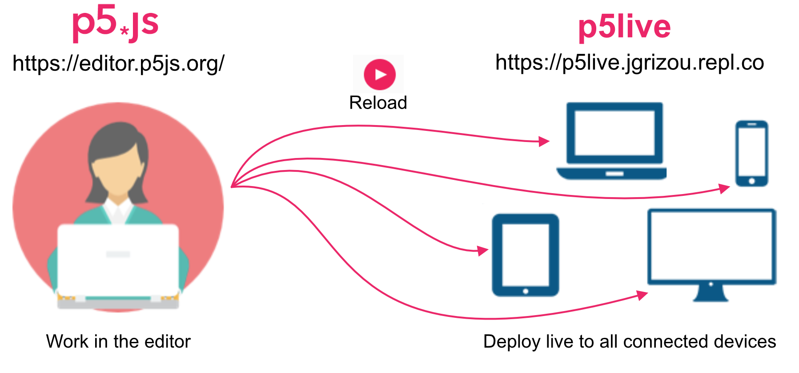
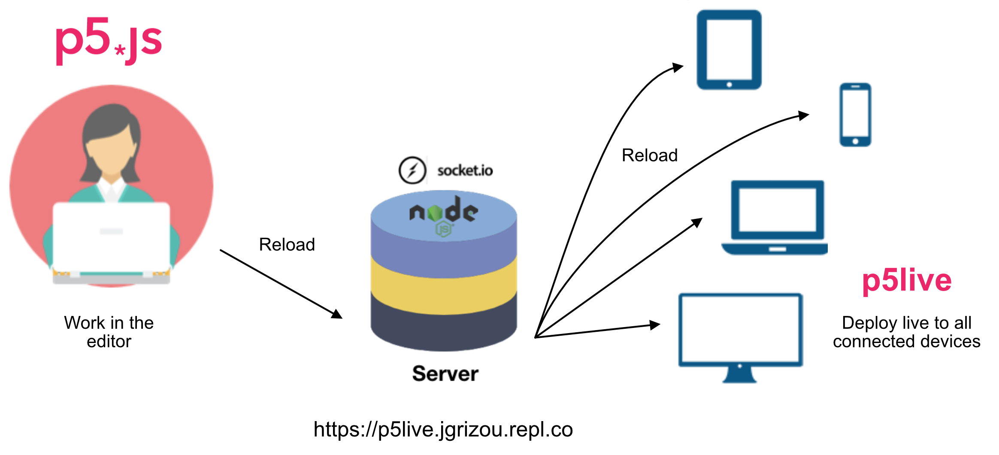
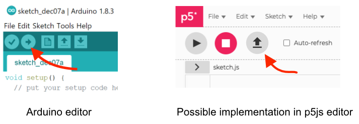

# p5live

A p5.js sketch opened via https://p5live.jgrizou.repl.co/ will refresh automatically each time you save and run it in the [p5.js editor](https://editor.p5js.org/). 



For p5live to work, you only need to import the socket.io library and add 5 lines of code in your sketch.js file, see [getting started guide](#getting-started).

## Explainer videos

- Short (2min): https://youtu.be/_MkSuxJA6Rs
- Longer (5min): https://youtu.be/h-FjfuE0gPc

## Use-case

This is useful when your work is hard to access physically but needs to be debugged/tweaked interactively and iteratively. 

For example if your p5.js sketch is displayed on a networked TV, an interactive board or a tablet/smartphone installed in a phsycial frame.

It is also very helful when debugging on multiple screen sizes e.g. tablet, smartphone, full- or half-screen. With p5live, you do not have to refresh every screen manually, they will all update at once remotely.

## Example

1. Open our demo p5.js sketch https://editor.p5js.org/jgrizou/sketches/Keik1He5v
2. If you go to https://p5live.jgrizou.repl.co/jgrizou/Keik1He5v, you will find the same sketch in full screen
3. Each time you click on the PLAY button in the p5 editor, the p5live version will auto-reload. 

*Note that only saved changes are propagated, so you will need to create an account and follow the steps below to get the full benefit. *

## Getting started

1. Create a p5.js account and start a sketch at https://editor.p5js.org/. 
2. Identify your `username` and `sketchID` in the editor url. For example, for https://editor.p5js.org/jgrizou/sketches/Keik1He5v, the username is `jgrizou`, and the sketchId is `Keik1He5v`
3. Load the socket.io v2.3.0 library in your p5.js project. In the header of `index.html` simply add the following:
```html
<script src="https://cdnjs.cloudflare.com/ajax/libs/socket.io/2.3.0/socket.io.js">
```
4. Add a small script at the top of your `sketch.js` file that will trigger the reload action. Simple copy the following code at the top of the file and fill the `username` and `sketchId` field. 
```js
// we check if this is running in the editor
if (location.href == 'about:srcdoc') {
  // if yes, we connect ot the socket.io server
  const socket = io("https://p5live.jgrizou.repl.co/");
  socket.on('connect', () => {
    // on connect, we emit a reload message for our sketch
    socket.emit('reload', { username : YOUR_USERNAME, sketchId : YOUR_SKETCH_ID });
  });
}
```
5. Go to https://p5live.jgrizou.repl.co/, enter your `username` and `sketchId`. Or directly open https://p5live.jgrizou.repl.co/USERNAME/SKETCH_ID.
6. Test. Each time you save and click the PLAY button on the p5.js editor, the page at p5live will also be reloaded with the latest changes. Remember to save the sketch in p5.js (`CTRL+S`) otherwise it will not reload the latest version.

Hopefully this will be intergrated within the p5.js editor at some point and you will not need to do any of the steps above.

## How it works

p5live uses a socket.io server to exchange message between the p5.js editor and the p5live version of the sketch. See technical video: https://youtu.be/jMjfwORo1RE



The p5live version is simply a full screen embedding of the p5.js sketch, e.g.

```html
<iframe src="https://editor.p5js.org/jgrizou/embed/Keik1He5v"></iframe>
```

When loaded the page connect ot the socket.io server hosted at https://p5live.jgrizou.repl.co/ and register to a room that is a combination of the username and sketchId.

The page then listen for a reload event that is sent when the code is run in the editor. On reload, the iframe is simply reloaded forcing the page to pull the sources again from the p5js server.

```js
socket.on('reload', () => {
  var iframe = document.getElementById('sketch');
  iframe.src = iframe.src;
});
```

This will not work if the sketch has not been saved within the editor yet.

### Hosting

p5live is entirely hosted on [replit](https://repl.it/) in a Node.js environment. This means you can inspect and run the code for yourself at https://repl.it/@jgrizou/p5live.

The server is maintened alive thanks to their [Always On feature](https://docs.repl.it/repls/always-on). 

### Next

This version might not scale and is not at all fool proof. For example, the user need to manually enter the username and sketchId, and the socket.io server is publicly accessible by anyone. It is thus fairly easy to force reload of any sketch providing an attacker know the username and sketchId. 

Integrating p5live into the p5.js editor would be the right way to implement p5live functionality. This repository is a way to test if the live feature is of use to the community. If shown useful, I am sure we can work with the p5.js editor team to implement it natively.

Please register your interest to the p5js editor team on Github at https://github.com/processing/p5.js-web-editor/issues/1817

A potential analogy to use in the editor interface is the idea of deploying/uploading the work, similar to uploading code to an Arduino device in the Arduino IDE. This could be done using a third button on the interface, that would deploy/upload your p5.js code to all live location/devices.




## Thanks

Thanks to the [p5.js community](https://p5js.org/) and the [Repl.it team](https://replit.com/) for making playing with code online and sharing with the world so accessible.